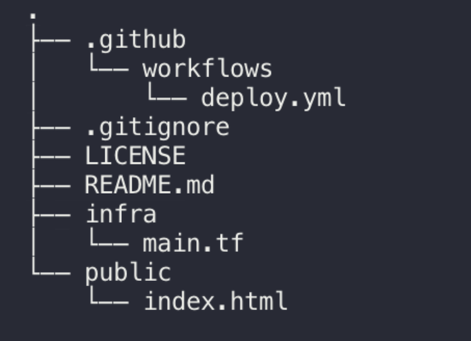

# s3-website
builds a s3 website with cloudfront  using cloudposse aws-cloudfront-s3-cdn
you will first need to run the command below to generate the ACM cert via the cli 

###
REPO MAP 



### Generating ACM Certificate

Use the AWS cli to [request new ACM certifiates](http://docs.aws.amazon.com/acm/latest/userguide/gs-acm-request.html) (requires email validation)
```
aws acm request-certificate --domain-name example.com --subject-alternative-names a.example.com b.example.com *.c.example.com
```

#### Github vars 

Creating encrypted secrets for a repository
To create secrets for a user account repository, you must be the repository owner. To create secrets for an organization repository, you must have admin access.

Use the documentation here 
https://docs.github.com/en/actions/reference/encrypted-secrets


